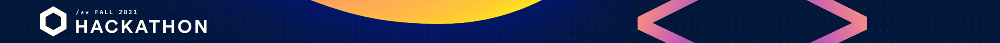

*First project without a guide, carried out step by step for Chainlink Fall 2021 Hackathon.*
_Team: [Pinajmr](https://www.linkedin.com/in/pinajmr/) Dev and [Sarap](https://www.linkedin.com/in/sarahrappeneau/) UI & UX. Feel free to make a contribution or correction, beginner project._

# Cerber - The Blockchain Password Manager

#### Cerber is a password manager that uses decentralization and security that only the blockchain can guarantee. Cerber is a site that helps you manage your passwords safely and without having a third party, so that only you have access to them. Passwords will never be lost, no central server is required.

<!--  -->

##### [Link to site (soon)](https://)

### Problem

* If you encrypt the info into the blockchain, by the pseudo-random property of the blockchain you can't ensure that is 100% secure.
* Also say that with the GDPR laws implemented now, you can't have this user's info on the blockchain, because you can't remove it if the user asks you to do it.

### Solve:
* Use a Oracle like Chainlink.

### Features:
- 

### How to use:
* Step 1: 

### How it works
* Blockchain uses the [Polygon ](https://polygon.technology/) and each user account is linked to a Ether account.
* Can you login with external provider like metamask
* Cerber saves the encrypted passwords/secret notes on the Polygon blockchain.
* Hence, your passwords will be accessible to you anytime and anywhere, as long as you have your private key
* No one but you can decrypt the encrypted passwords. Thus, you are truly in control of your passwords.

##### Encryption

##### Decryption

### Why blockchain?
* Password managers are essential these days, when we have to manage lots of different passwords (which shouldn't be reused)
* There are lots of potential problems with the existing centralized password managers:
  * Single point of failure: if the server/database goes down, there goes your passwords
  * Trust issue: can you really trust that these closed-source softwares will not just read your passwords?
* Cerber solves all of these problems:
  * The passwords are stored on the decentralized database that is the Nebulas blockchain, hence it will not go down easily
  * The passwords are encrypted by your private key which belongs to only you. You are the only one who can see your saved passwords.

### Contract address
Our deployed contract on the Kovan testnet can be found the last beta version [here](https://kovan.etherscan.io/address/0x7219447e33769e3c4f80e24a9cac28247465d7b8).

### Donations

* <strong>ETH: </strong>0x4317c44fD3143D8AC5723865CF046238A2cd8FD3

